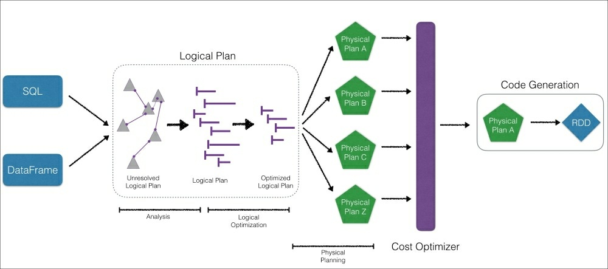

# Intro
This is start 

# RDD 
Check the paper first.

## Read file

The .collect() method returns all the elements of the RDD to the
driver where it is serialized as a list.

## Transformation
#### map
## Operations
#### count()
#### take(# of smaple)
#### collect()
#### reduce
## Lazy Principle

## DataFrame
#### Catalyst Optimizer refresh

#### Speed ISSUE

It is important to note that while, with DataFrames, PySpark is often
significantly faster, there are some exceptions. The most prominent one
is the use of Python UDFs, which results in round-trip communication
between Python and the JVM. Note, this would be the worst-case
scenario which would be similar if the compute was done on RDDs

#### No map here :(

# Reference

 1. List item

<!--stackedit_data:
eyJoaXN0b3J5IjpbMTg5ODY4Nzk4OCwxNDM2MTg1MDQ5LC04MT
E5MTAyMiwtMTE5MDg0NjQyXX0=
-->