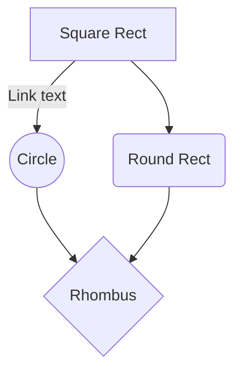

You can also render sequence diagrams like this:

```sequence
Alice->Bob: Hello Bob, how are you?
Note right of Bob: Bob thinks
Bob-->Alice: I am good thanks!
```

And flow charts like this:



# Dataloader from ICX
- which part we should use on Amazon


# Necessary
## Lantancy
- 15 min prediction
- 
## Throughput
- Individual modeling host. 
- Trainning 

 And flow charts like this:
# Question

```sequence  
Alice->Bob: Hello Bob, how are you?  
Note right of Bob: Bob thinks  Bob->Alice: I am good thanks!  
```


# Analysis Tool
## Phase 1 collecting requirements
- Index variety signal, for examples, stock price and volume. In oil specific industry, the crude oil price can be another key factor can provide useful information
- Batch process cross all the stock price
- Basic graph and interactive user interface are necessary in this product
- Search engine on timer-series data
- Personal models storage 
<!--stackedit_data:
eyJoaXN0b3J5IjpbMTM3MjQ4ODQwOSwxNTQzODQyODYzLC0yMD
c2NTYxNzg5LDIzMzA2Mjg5MywxNjc1ODc2NDUzLC0xNTkyNzQw
MjYyLDY0OTA5NzAxM119
-->