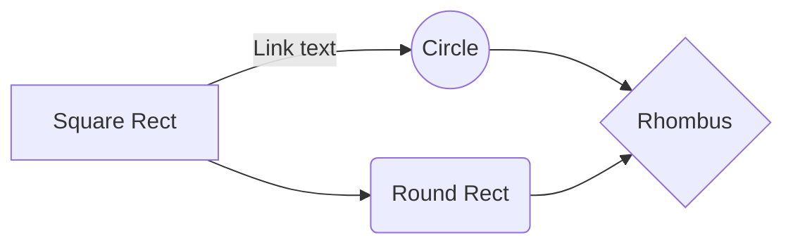

You can also render sequence diagrams like this:

```sequence
Alice->Bob: Hello Bob, how are you?
Note right of Bob: Bob thinks
Bob-->Alice: I am good thanks!
```

And flow charts like this:





# Necessary
## Lantancy
- 15 min prediction
- 
## Throughput
- Individual modeling host. 
- Trainning 

 And flow charts like this:
# Question

```sequence  
Alice->Bob: Hello Bob, how are you?  
Note right of Bob: Bob thinks  Bob->Alice: I am good thanks!  
```
<!--stackedit_data:
eyJoaXN0b3J5IjpbMjMzMDYyODkzLDE2NzU4NzY0NTMsLTE1OT
I3NDAyNjIsNjQ5MDk3MDEzXX0=
-->